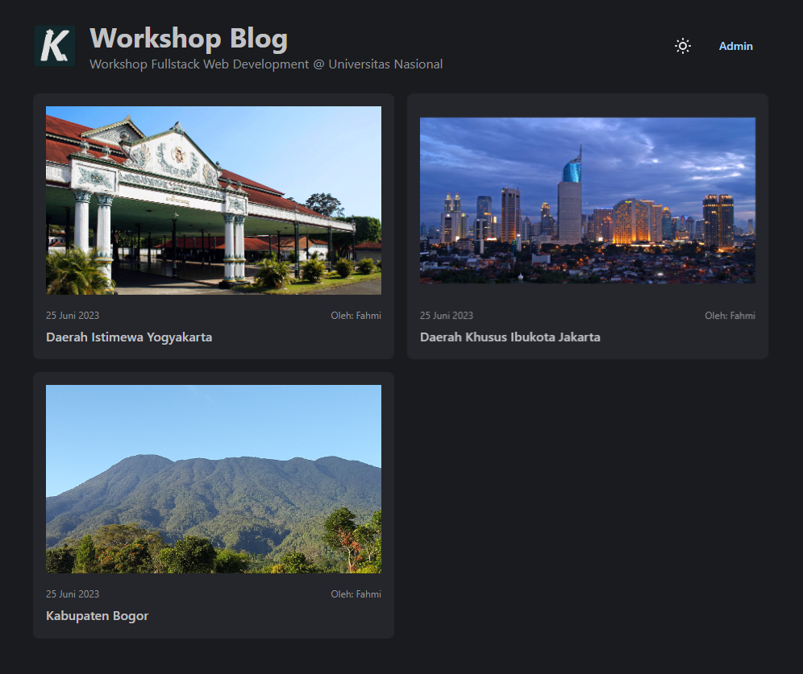
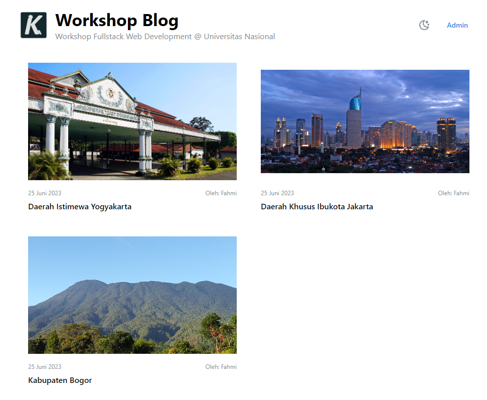
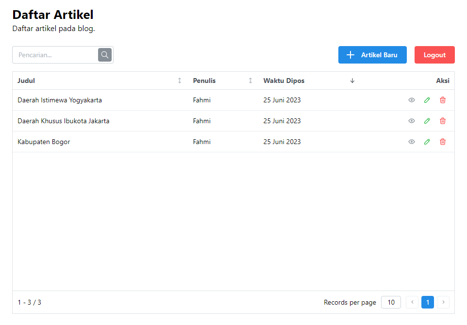
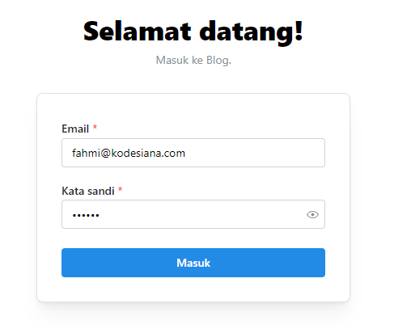

# Prisma + React Micro Blog

This repository contains the final project for **Workshop Fullstack Web Development** at Universitas Nasional by Fahmi Noor Fiqri (4-5 July 2023). The repository consists of two parts, the backend (MySQL+Prisma+Express) and frontend (Vite+React+Mantine).

## System Requirements

1. NodeJS 18 or newer
2. MySQL instance (any flavor, XAMPP, Docker, etc.)

## Running the Project

> Before using this repo, it is encouraged to fork and clone this repository first.

In this tutorial, I'm assuming you're going to use the default settings for both the backend and frontend.
You can simply copy the default environment file but ONLY CHANGE the `DATABASE_URL` in the backend repo
so it can connect to your local database, leave other settings without any changes.

### Part 1 - Backend

1. Start a local MysQL instance
2. Create a `.env` file based on the `.env.example` file
3. Adjust your environment configuration according to your DB configuration
4. Run `npm install` to install package dependencies
5. Run `npx prisma migrate dev` to initialize database schema
6. (optionally) Run `npx prisma db seed` to insert initial/seed data
7. Run `npm run dev` to start the REST API server (port 3000)

### Part 2 - Frontend

1. Run `npm install` to install package dependencies
2. Run `npm run dev` to start the web app (port 5173)

## Screenshots

</img>
</img>
</img>
</img>
</img>

## License

Licensed under MIT License.
